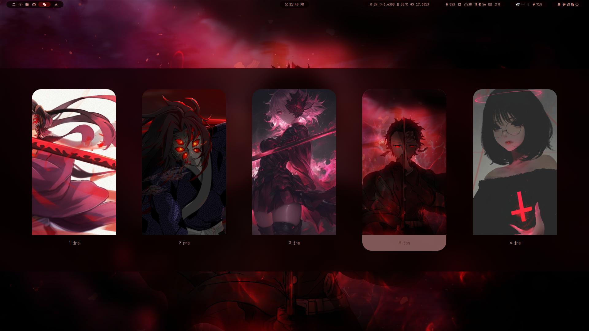

###### _<div align = right><sub>// design by mahaveer</sub></div>_

<div align="center">
    <a href="https://discord.gg/AYbJ9MJez7">
            
    </a>
</div>

<div align="center">
    
    <br><br>
</div>

> [!IMPORTANT]
> This is not a standalone theme, needs [HyDe](https://github.com/prasanthrangan/hyprdots) installed...

<br>

# HyDE Themes

---

[](https://github.com/mahaveergurjar/Theme-Gallery/tree/Greenify)


### Installation

```sh
Hyde theme patch "Greenify" https://github.com/mahaveergurjar/Theme-Gallery/tree/Greenify
```

or

```sh
Hyde theme patch
```

and choose Greenify

---

---

</br>

[](https://github.com/mahaveergurjar/Theme-Gallery/tree/Monokai)




## Installation

```sh
Hyde theme patch "Monokai" https://github.com/mahaveergurjar/Theme-Gallery/tree/Monokai
```

or

```sh
Hyde theme patch
```

and choose Monokai

---

---

[](https://github.com/mahaveergurjar/Theme-Gallery/tree/Red-Stone)


### Installation

```sh
Hyde theme patch "Red-Stone" https://github.com/mahaveergurjar/Theme-Gallery/tree/Red-Stone
```

or

```sh
Hyde theme patch
```

and choose Red-Stone

---

or install another theme from [HyDe Gallery](https://github.com/kRHYME7/hyde-gallery)
